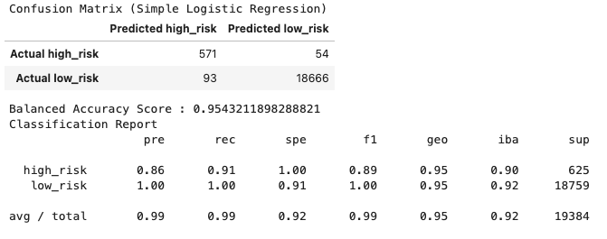
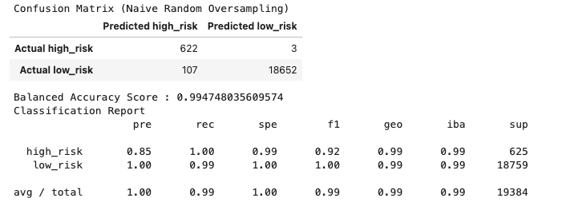
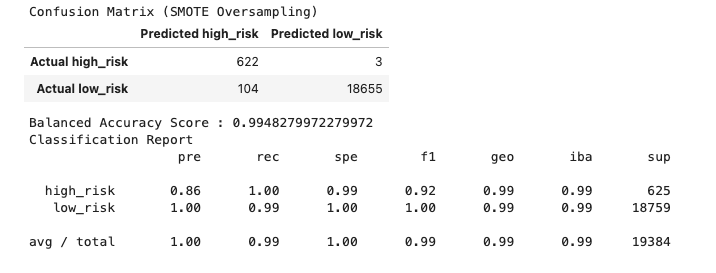
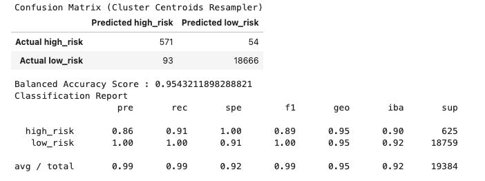
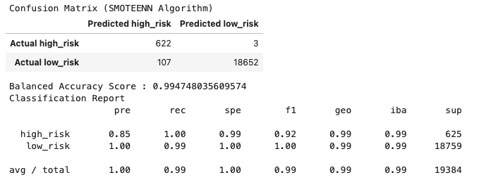
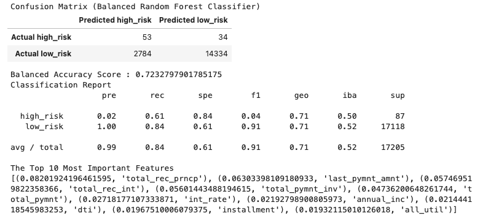
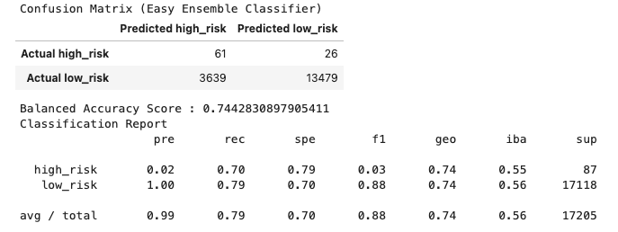

# Machine_Learning
# Unit 11 - Risky Business
 

## Background

Mortgages, student and auto loans, and debt consolidation are just a few examples of credit and loans that people seek online. Peer-to-peer lending services such as Loans Canada and Mogo let investors loan people money without using a bank. 

In this assignment I built and evaluated several machine learning models to predict credit risk using data you'd typically see from peer-to-peer lending services. Credit risk is an inherently imbalanced classification problem (the number of good loans is much larger than the number of at-risk loans), so I needed to employ different techniques for training and evaluating models with imbalanced classes. I used the imbalanced-learn and Scikit-learn libraries to build and evaluate models using the two following techniques:

1. [Resampling](#Resampling)
2. [Ensemble Learning](#Ensemble-Learning)

- - -

## Files Used 

[Resampling Starter Notebook](Starter_Code/credit_risk_resampling.ipynb)

[Ensemble Starter Notebook](Starter_Code/credit_risk_ensemble.ipynb)

[Lending Club Loans Data](Resources/LoanStats_2019Q1.csv.zip)

- - -

### Resampling

I used the [imbalanced learn](https://imbalanced-learn.readthedocs.io) library to resample the LendingClub data and build and evaluate logistic regression classifiers using the resampled data.

1. Simple Logistic Regression Results
 

2. Naive Random Oversampler Results
 

3. SMOTE Oversampling Results
 

4. Cluster Centroids Resampler Results
 

5. SMOTEENN Algorithm Results
 

## The above helps to answer the following questions:

Which model had the best balanced accuracy score?
 
<blockquote>

SMOTE (0.9948279972279972)
 

Which model had the best recall score?
 
<blockquote>

All models
 

Which model had the best geometric mean score?
 
<blockquote>

Oversampling, SMOTE, and Combination (Over and Under) Sampling
 

- - -

### Ensemble Learning

In this section, I trained and compared two different ensemble classifiers to predict loan risk and evaluate each model. I used the [Balanced Random Forest Classifier](https://imbalanced-learn.org/stable/references/generated/imblearn.ensemble.BalancedRandomForestClassifier.html) and the [Easy Ensemble Classifier](https://imbalanced-learn.org/stable/references/generated/imblearn.ensemble.EasyEnsembleClassifier.html). Refer to the documentation for each of these to read about the models and see examples of the code.

1. Balanced Random Forest Classifier Results
 

2. Easy Ensemble Classifier Results
 

## The above helps to answer the following questions:

Which model had the best balanced accuracy score?
 
<blockquote>

Easy Ensemble Classifier (0.74)
 

Which model had the best recall score?
 
<blockquote>

Balanced Random Forest Classifier (0.84)
 

    

Which model had the best geometric mean score?
 
<blockquote>

Easy Ensemble Classifier (0.74)
 

What are the top three features?
 
<blockquote>

1. total_rec_prncp (0.08201924196461595) 
2. last_pymnt_amnt (0.06303398109180933) 
3. total_rec_int (0.057469519822358366) 

- - -
